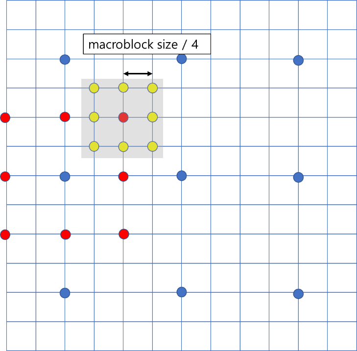

# ME-MC
움직임 추정 및 보상

9th frame				     10th frame

Frame을 16 x 16 의 단위 Block에서 16x16, 8x16, 16x8, 8x8 Mode로 ME을 수행하였다.

이 중 Cost가 가장 작은 Mode로 MC를 수행하였다.

Cost는 다음과 같은 식으로 계산하였다.

cost= MAD+ λ\* |MVD|

lambda의 값을 2.0, 1.5, 1.0, 0.5, 0.1 로 바꿔가며 실험한 결과는 다음과 같다.

1. Lambda = 2.0
   1. 변수

|Key|Value|
| :- | :- |
|Lambda|2.0|
|Frame|10|

1. 결과
   1. 이미지

 

1. 값

|Key	|Value|
| :- | :- |
|PSNR|39.0346dB|
|Mode : 16x16|69.1919%|
|Mode : 8x16|3.28283%|
|Mode : 16x8|16.1616%|
|Mode : 8x8|11.3636%|

1. Lambda = 1.5
   1. 변수

|Key|Value|
| :- | :- |
|Lambda|1.5|
|Frame|10|

1. 결과
   1. 이미지

`  `

1. 값

|Key	|Value|
| :- | :- |
|PSNR|39.2209dB|
|Mode : 16x16|66.9192%|
|Mode : 8x16|4.54545%|
|Mode : 16x8|14.1414%|
|Mode : 8x8|14.3939%|

1. Lambda = 1.0
   1. 변수

|Key|Value|
| :- | :- |
|Lambda|1.0|
|Frame|10|

1. 결과
   1. 이미지

1. 값

|Key	|Value|
| :- | :- |
|PSNR|39.2559|
|Mode : 16x16|64.1414%|
|Mode : 8x16|3.78788%|
|Mode : 16x8|12.8788%|
|Mode : 8x8|19.1919%|

1. Lambda = 0.5
   1. 변수

|Key|Value|
| :- | :- |
|Lambda|0.5|
|Frame|10|

1. 결과
   1. 이미지

` `

1. 값

|Key	|Value|
| :- | :- |
|PSNR|39.3177|
|Mode : 16x16|59.596%|
|Mode : 8x16|2.52525%|
|Mode : 16x8|8.83838%|
|Mode : 8x8|29.0404%|

1. Lambda = 0.1
   1. 변수

|Key|Value|
| :- | :- |
|Lambda|0.1|
|Frame|10|

1. 결과
   1. 이미지

` `

1. 값

|Key	|Value|
| :- | :- |
|PSNR|39.3551|
|Mode : 16x16|46.7172%|
|Mode : 8x16|0.505051%|
|Mode : 16x8|2.0202%|
|Mode : 8x8|50.7576%|

1. 결과 평가
   1. Lambda 값이 감소 함에 따라 PSNR 값이 증가하는 것을 확인할 수 있다.

이는 Motion Vector Difference의 Cost에 대한 도미넌스가 감소하여 8x8 Partition가 더 많이 선택되기 때문인 것으로 보인다.

1. Half-pel
   1. 알고리즘 실행 과정

Full search, 또는 3-step search로 탐색한 위치에서 소수점 단위 화소를 선형 보간법을 이용하여 1/2 픽셀 단위의 움직임 비교를 수행함.

실수 단위 비교를 수행하기 위해 가로 방향으로 선형 보간을 수행한 후, 세로 방향으로 선형 보간을 수행하여 실수 단위 프레임을 생성함.

1. 결과

<halfpel>				 <Non halfpel >

||halfpel|Non halfpel|
| :- | :-: | :-: |
|PSNR(dB)|38.6709|38.93219|
정수 화소 단위 움직임 탐색 및 보상 보다 실수 화소 단위 움직임 탐색 및 보상의 PSNR이 더 높은것으로 확인됨.

1. 고찰

낮은 PSNR 증가율을 보이는데, 선형 보간법 대신  다른 보간법을 이용하거나, Quarter pel 을 이용하면 더 높은 PSNR 증가율을 얻을 수 있을 것으로 보인다.

1. Q
1. 3-step search algorithm
   1. 알고리즘 실행 과정
      1. Step 1

현재 target block 위치에서 현재 위치와 8방향으로 macroblock size 만큼 떨어진 motion vector를 가진 macro block 의 SAD를 측정함

1. Step 2

현재 이전 SAD의 위치에서 8방향으로 (macroblock size / 2) 만큼 떨어진 motion vector를 가진 macro block 의 SAD를 측정함

1. Step 3

Step 2와 같은 작업을 수행함. 이 중 가장 target frame과 차이가 적은 Motion vector를 선택.

1. 결과

`		`<3-Step Search>				 <Full Search>

||3step|Full search|
| :- | :-: | :-: |
|PSNR(dB)|38.6709|38.9566|
|Execution time(s)|0.181|324.93|
(Lambda = 1.0)

각 Block 당 337 \* 273 번의 비교를 수행하는 Full Search에 비해 25번의 비교를 수행한다.

이 때문에 실행시간이 매우 작은 것을 확인할 수 있었고, 또한 Full Search 보다 3step Search의 PSNR 값이 작긴 하지만, 큰 차이가 없는 것을 확인할 수 있었다.
